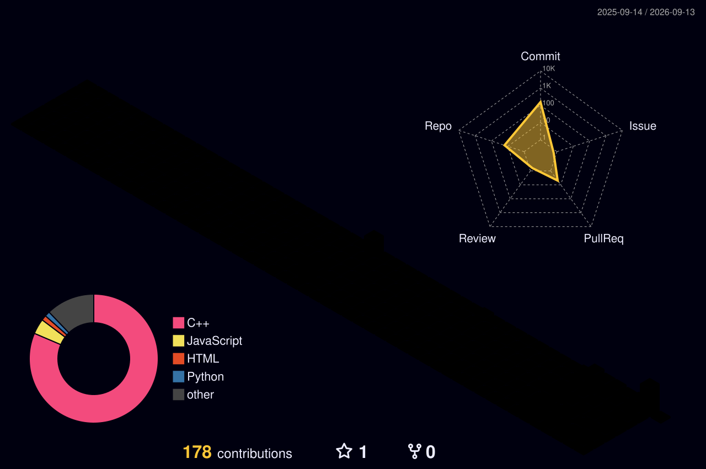

<!-- ===================== HEADER ===================== -->

 

### Computer Science & Cybersecurity Student

**Google Cloud · AWS · AI · Web3**

 

  

 

---

<!-- ===================== ABOUT ===================== -->

## About Me

> **Vo na Mirza na Ghalib na John hain,**  
> **Aao tumhe batayein Prem kaun hain.**

I'm a Computer Science & Cybersecurity student building with **Google Cloud,
AWS, AI, Web3 and modern software technologies**.

I like learning by building, participating in hackathons, and working with
developer communities.

Currently focused on **cloud computing, Generative AI, DSA, Web3 and software
development**.

> **Not good at coding, but good at guitar and poetry. ⚠️**

---

<!-- ===================== CURRENTLY ===================== -->

## What I'm Building

<table>
<tr>

<td width="50%" valign="top">

### Cloud

Building and experimenting with applications using:

- Google Cloud
- AWS
- Cloud APIs
- Vertex AI
- Amazon Bedrock

</td>

<td width="50%" valign="top">

### AI & Web3

Exploring:

- Generative AI
- LLM applications
- Blockchain
- Web3
- Smart contracts

</td>

</tr>
</table>

---

<!-- ===================== TECH STACK ===================== -->

## Tech Stack

### Cloud

### Languages

### Development

### AI & Web3

---

<!-- ===================== PROJECTS ===================== -->

## Featured Projects

<table>
<tr>

<td width="50%" valign="top">

### HireMe

A Web3 hiring platform exploring blockchain-based trust, verification and
digital opportunities.

**React · JavaScript · Web3 · Monad**

 

<a href="https://github.com/premxpagar/HireMe">
View Repository →
</a>

</td>

<td width="50%" valign="top">

### CricComic App

A cricket-focused application created for the GDG Mumbai community.

**React · JavaScript · HTML · CSS**

 

<a href="https://github.com/premxpagar/CricComic-App-GDG-MUMBAI">
View Repository →
</a>

</td>

</tr>

<tr>

<td width="50%" valign="top">

### EmailAnalyzer

An AI-powered email analysis project for understanding incoming emails and
identifying important or potentially suspicious messages.

**AI · LLM APIs · Python · REST APIs**

</td>

<td width="50%" valign="top">

### TrustFund AI

An AI and blockchain project exploring transparent digital fund management
and verification.

**AI · Blockchain · Web3 · Smart Contracts · Cloud**

</td>

</tr>
</table>

---

<!-- ===================== CLOUD ===================== -->

## Google Cloud × AWS

<table>
<tr>

<td width="50%" valign="top">

<h3 align="center">Google Cloud</h3>

- Google Cloud Platform
- Gemini
- Vertex AI
- Generative AI
- Google developer ecosystem
- Google Student Ambassador

</td>

<td width="50%" valign="top">

<h3 align="center">AWS</h3>

- AWS Cloud
- Amazon Bedrock
- Generative AI
- AWS Builder ecosystem
- AWS Student Builder Group Leader

</td>

</tr>
</table>

---

<!-- ===================== COMMUNITY ===================== -->

## Community & Leadership

**Google Student Ambassador**  
GID 2166

**AWS Student Builder Group Leader**  
2026 – 2027

**The Web3 Club**  
Community Builder

I also host and organize developer events, cloud sessions and hackathons.

---

<!-- ===================== ACHIEVEMENTS ===================== -->

## Achievements

<table>
<tr>

<td>

- Google Skills Arcade — Arcade Trooper
- Google Skills Arcade Season 2
- Aspire Leaders Program — Module 2
- Google Student Ambassador

</td>

<td>

- AWS Student Builder Group Leader
- Monad Blitz Mumbai
- Smart India Hackathon
- Technical event host and organizer

</td>

</tr>
</table>

---

<!-- ===================== GITHUB STATS ===================== -->

## GitHub Stats

  

---

<!-- ===================== ACTIVITY ===================== -->

## Contribution Activity

---

<!-- ===================== PACMAN ===================== -->

## Pac-Man Contributions

<picture>

<source
media="(prefers-color-scheme: dark)"
srcset="https://raw.githubusercontent.com/premxpagar/premxpagar/output/pacman-contribution-graph-dark.svg"
/>

<source
media="(prefers-color-scheme: light)"
srcset="https://raw.githubusercontent.com/premxpagar/premxpagar/output/pacman-contribution-graph.svg"
/>

</picture>

---

<!-- ===================== 3D ===================== -->

## 3D Contributions

---

<!-- ===================== LEARNING ===================== -->

## Currently Learning

---

<!-- ===================== CONNECT ===================== -->

## Find Me Online

 

<!-- ===================== FOOTER ===================== -->

### Building with cloud. Learning by building.

