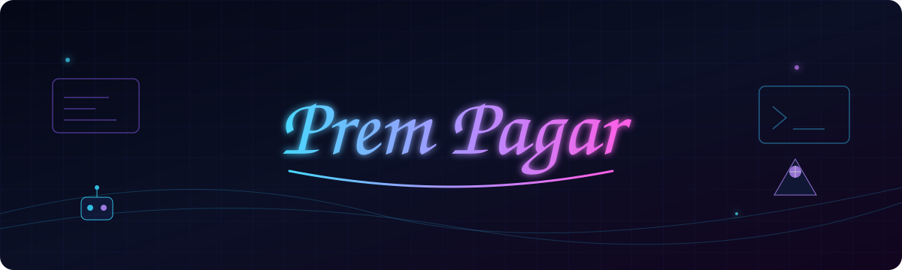

## About Me

> **Vo na Mirza na Ghalib na John hain,**  
> **Aao tumhe batayein Prem kaun hain.**

Building with **Cloud, AI, Web3 and Cybersecurity**. I learn by building, join hackathons, and work with developer communities.

> **Not good at coding, but good at guitar and poetry. ⚠️**

## Tech Stack

## Featured Projects

| Project | What it is |
|---|---|
| **[HireMe](https://github.com/premxpagar/HireMe)** | Web3 hiring platform exploring trust, verification and digital opportunities. |
| **[CricComic App](https://github.com/premxpagar/CricComic-App-GDG-MUMBAI)** | Cricket-focused application built for the GDG Mumbai community. |
| **EmailAnalyzer** | AI-powered email analysis and classification project. |
| **TrustFund AI** | AI + blockchain concept for transparent fund management and verification. |

## Cloud & Communities

**Google Cloud** — Gemini · Vertex AI · Google Student Ambassador  
**AWS** — AWS Cloud · Bedrock · AWS Student Builder Group Leader  
**The Web3 Club** — Community Builder

## Achievements

- Google Skills Arcade — Arcade Trooper
- Google Student Ambassador
- AWS Student Builder Group Leader
- Aspire Leaders Program — Module 2
- Monad Blitz Mumbai
- Smart India Hackathon
- Technical event host and organizer

## GitHub Stats

 

## Contribution Activity

## Pac-Man Contributions

<picture>
<source media="(prefers-color-scheme: dark)" srcset="https://raw.githubusercontent.com/premxpagar/premxpagar/output/pacman-contribution-graph-dark.svg" />
<source media="(prefers-color-scheme: light)" srcset="https://raw.githubusercontent.com/premxpagar/premxpagar/output/pacman-contribution-graph.svg" />

</picture>

## 3D Contributions

## Connect

